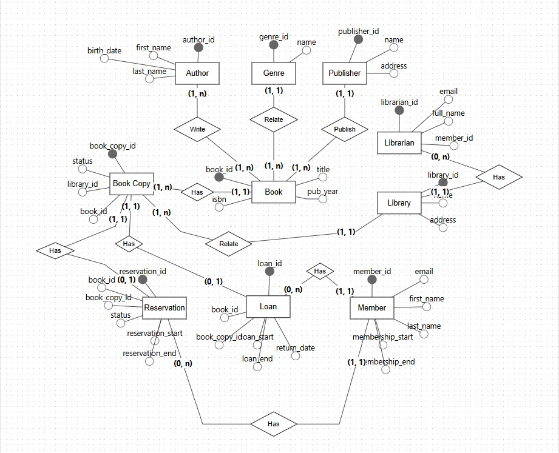

# Projeto Biblioteca Universitaria

Projeto de banco de dados relacional desenvolvido durante os estudos de PostgreSQL, com foco na modelagem e implementacao de um sistema de biblioteca universitaria.

O projeto aplica conceitos fundamentais e avancados de bancos de dados, incluindo modelagem entidade-relacionamento, criacao de tabelas, relacionamentos, consultas SQL, subconsultas, joins, views, triggers, stored procedures e analise de performance com `EXPLAIN ANALYZE`.

## Sobre o projeto

O banco `sistema_biblioteca_universitaria` representa uma estrutura para gerenciamento de bibliotecas, livros, autores, editoras, membros, bibliotecarios, emprestimos e reservas.

Entre as principais entidades modeladas estao:

- Autores
- Editoras
- Membros
- Generos
- Livros
- Bibliotecas
- Copias de livros
- Bibliotecarios
- Emprestimos
- Reservas

## Modelagem

A modelagem do banco esta representada na imagem abaixo:



## Tecnologias e ferramentas

- PostgreSQL
- SQL
- PL/pgSQL
- Beekeeper Studio
- Git e GitHub

## Estrutura dos arquivos

| Arquivo | Descricao |
| --- | --- |
| `creating_database.sql` | Cria o banco de dados do sistema de biblioteca. |
| `creating_tables.sql` | Define as tabelas, chaves primarias, chaves estrangeiras e relacionamentos. |
| `insert_data.sql` | Popula o banco com dados de exemplo. |
| `creating_views.sql` | Cria uma view para consulta de copias disponiveis por filial. |
| `procedure.sql` | Cria uma stored procedure para registrar emprestimos. |
| `triggers.sql` | Cria uma trigger para atualizar o status da copia apos um emprestimo. |
| `creating_index.sql` | Arquivo reservado para criacao de indices. |
| `practicing.sql` | Reune consultas de pratica com filtros, joins, agregacoes, subqueries, CTEs e analise de performance. |
| `modelagem_biblioteca_db.png` | Imagem da modelagem do banco de dados. |

## Conceitos praticados

- Criacao e estruturacao de banco de dados relacional
- Definicao de tabelas e relacionamentos
- Uso de `PRIMARY KEY`, `FOREIGN KEY`, `UNIQUE` e `NOT NULL`
- Insercao, atualizacao e remocao de dados
- Consultas com filtros e operadores SQL
- Joins entre tabelas
- Agregacoes com `COUNT`, `MIN`, `MAX` e `AVG`
- Subconsultas e `NOT EXISTS`
- Common Table Expressions, usando `WITH`
- Criacao de views
- Criacao de functions, triggers e stored procedures
- Analise de consultas com `EXPLAIN ANALYZE`

## Como executar

Execute os scripts em um ambiente PostgreSQL na seguinte ordem:

```sql
-- 1. Criar o banco
\i creating_database.sql

-- 2. Conectar ao banco criado
\c sistema_biblioteca_universitaria

-- 3. Criar as tabelas
\i creating_tables.sql

-- 4. Popular o banco
\i insert_data.sql

-- 5. Criar view, procedure e trigger
\i creating_views.sql
\i procedure.sql
\i triggers.sql

-- 6. Executar consultas de pratica
\i practicing.sql
```

Tambem e possivel executar os arquivos manualmente em ferramentas como o Beekeeper Studio.

## Objetivo de aprendizado

Este projeto consolida conhecimentos adquiridos em um curso de banco de dados com PostgreSQL, partindo dos fundamentos de SQL e modelagem ate recursos mais avancados, como procedures, triggers, seguranca, backup, indices e otimizacao.

O objetivo e demonstrar a capacidade de estruturar um banco relacional completo e aplicar consultas e recursos SQL em um contexto proximo de um sistema real.
